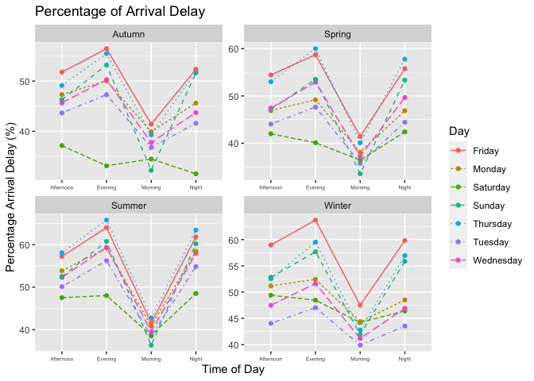
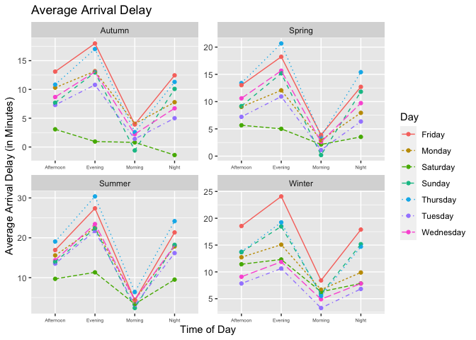
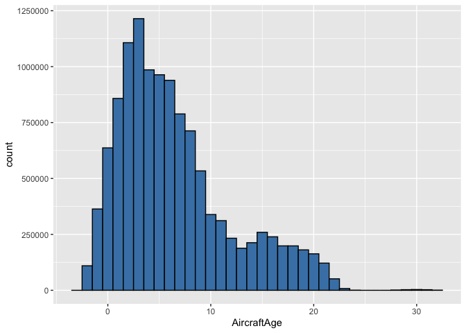
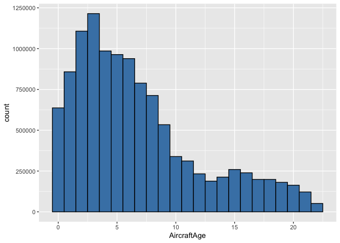
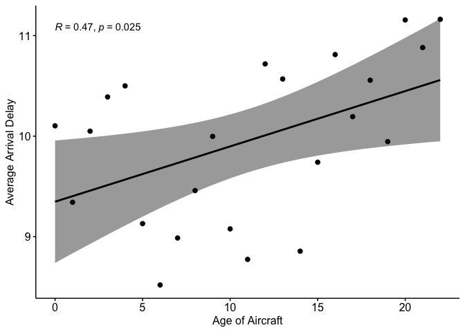
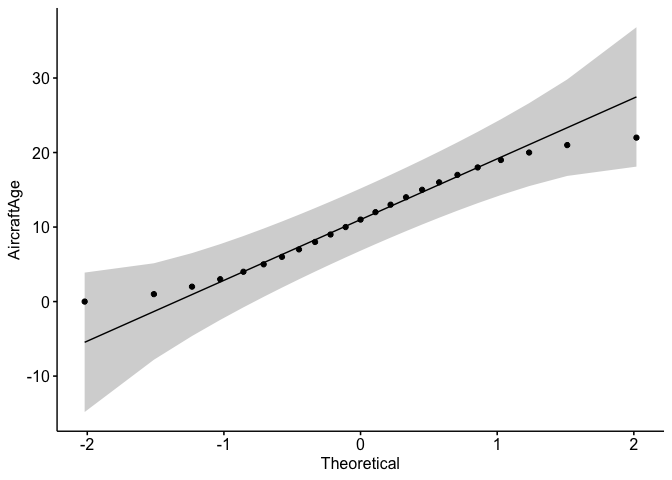
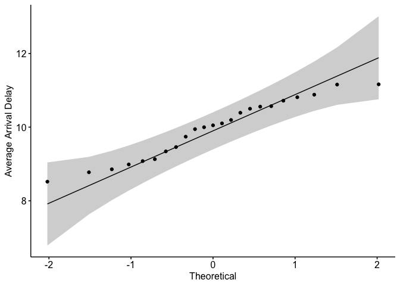
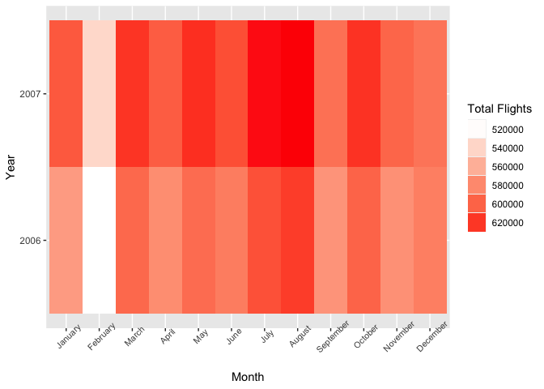
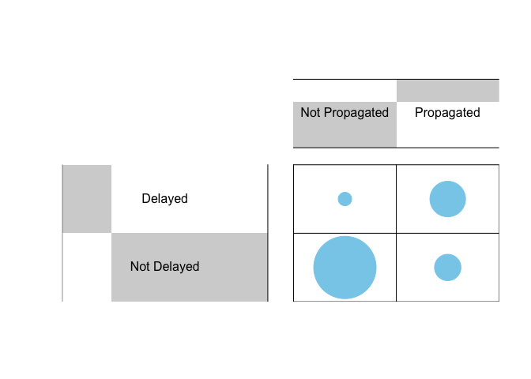
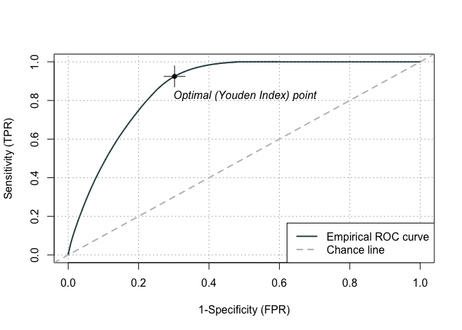

ST2195 Programming for Data Science Coursework
================
Sebastian Tock Shao Xuan - Student ID: 210502989
2/25/2022

In this file, we are going to perform data analysis on the Airline
on-time data from the 2009 ASA Statistical Computing and Graphics Data
Expo, the data consists of flight arrival and departure details for all
commercial flights on major carriers within the USA, between October
1987 and April 2008. This is a very large dataset, therefore we have
only selected a subset of consecutive years ranging from 2006 to 2007,
the analysis is supported by relevant supplementary data available in
the data expo.

Included in this file, will be the steps taken starting from the
extraction of the raw data up to the answer for each question. Before we
begin the analysis it needs to be noted that there will be 3 .csv files
in total that will be used in this analysis (2006.csv, 2007.csv and
plane-data.csv). The .csv files can be downloaded from the Harvard
Dataverse at <https://doi.org/10.7910/DVN/HG7NV7>

Through this analysis we are going to answer the following questions:

-   When is the best time of day, day of the week, and time of the year
    to fly to minimize delays?
-   Do older planes suffer more delays?
-   How does the number of people flying between different locations
    change over time?
-   Can you detect cascading failures as delays in one airport create
    delays in others?
-   Use the available variables to construct a model that predicts
    delays.

## Pre-Analysis Preparations

### Required libraries

The following are the required libraries to run this file, if you are
missing any of the packages please install them using the
`install.packages("missing package name")` in the R console.

``` r
# These are the packages used for the analysis
library(dplyr) 
library(tidyverse)
library(ggplot2)
library(scales) 
library(reshape2)
library(lubridate)
library(gplots) 
library(ggpubr)
library(caret) 
library(ROCit)
library(AUC)
```

After loading the required libraries we are going to load in the .csv
files. Please ensure this file is in the same folder as the .csv files
for this to work.

#### Loading in Data set

Before any analysis can be done we will need to extract the data from
the .csv files into data frames that we can manipulate in R.

The 2006.csv and 2007.csv are to be extracted to form the ontime data
frame.

The plane-data.csv is to be extracted to form the planes data frame.

``` r
# ========== Load in relevant data from .csv files ===============
# loading in planes data from .csv file
planes <- read.csv("plane-data.csv", header = TRUE) 
```

To extract the plane-data.csv, we only need to use the `read.csv()`
function to load the .csv file into the planes data frame.

``` r
# ========== Load in relevant data from .csv files ===============
# Function that loads in the .csv files to be loaded into the ontime table
merged <- function(id = 1987:2008) {
  df <- data.frame()
  for(i in 1:length(id)){
    add <- read.csv(paste0(id[i], ".csv"), header =TRUE)
    df <- rbind(df, add)
  }
  assign("ontime", df, envir = .GlobalEnv)
} 

# A subset of 2 years ranging from 2006 - 2007 is chosen for my analysis
merged(2006:2007) 
```

To create the ontime data frame, we decided to define a function named
`merged()`.

The `merged()` function is based on the `read.csv()` function, the
function is made in such a way that it goes through a `for loop` that
loops through the selected years and then using the `rbind()` function
to append consecutive years into df, we then end the loop by passing df
into the ontime data frame in the global environment using `assign()`.

#### Looking at how the data has been structured

After loading in the data into data frames, we will have to look through
the data frame for any errors or corrupted data, and perform any data
cleaning that is needed. This needs to be done as the insights provided
by the analysis is only as good as the data we feed it, therefore, to
ensure an accurate and insightful analysis we will have to “clean” the
data.

##### ontime data frame

``` r
# Looking into the data structure of ontime
str(ontime)
```

    ## 'data.frame':    14595137 obs. of  29 variables:
    ##  $ Year             : int  2006 2006 2006 2006 2006 2006 2006 2006 2006 2006 ...
    ##  $ Month            : int  1 1 1 1 1 1 1 1 1 1 ...
    ##  $ DayofMonth       : int  11 11 11 11 11 11 11 11 11 11 ...
    ##  $ DayOfWeek        : int  3 3 3 3 3 3 3 3 3 3 ...
    ##  $ DepTime          : int  743 1053 1915 1753 824 627 825 942 1239 1642 ...
    ##  $ CRSDepTime       : int  745 1053 1915 1755 832 630 820 945 1245 1645 ...
    ##  $ ArrTime          : int  1024 1313 2110 1925 1015 834 1041 1155 1438 1841 ...
    ##  $ CRSArrTime       : int  1018 1318 2133 1933 1015 832 1021 1148 1445 1845 ...
    ##  $ UniqueCarrier    : chr  "US" "US" "US" "US" ...
    ##  $ FlightNum        : int  343 613 617 300 765 295 349 356 775 1002 ...
    ##  $ TailNum          : chr  "N657AW" "N834AW" "N605AW" "N312AW" ...
    ##  $ ActualElapsedTime: int  281 260 235 152 171 127 136 133 119 119 ...
    ##  $ CRSElapsedTime   : int  273 265 258 158 163 122 121 123 120 120 ...
    ##  $ AirTime          : int  223 214 220 126 132 108 111 121 103 105 ...
    ##  $ ArrDelay         : int  6 -5 -23 -8 0 2 20 7 -7 -4 ...
    ##  $ DepDelay         : int  -2 0 0 -2 -8 -3 5 -3 -6 -3 ...
    ##  $ Origin           : chr  "ATL" "ATL" "ATL" "AUS" ...
    ##  $ Dest             : chr  "PHX" "PHX" "PHX" "PHX" ...
    ##  $ Distance         : int  1587 1587 1587 872 872 644 644 644 644 644 ...
    ##  $ TaxiIn           : int  45 27 4 16 27 6 4 4 4 4 ...
    ##  $ TaxiOut          : int  13 19 11 10 12 13 21 8 12 10 ...
    ##  $ Cancelled        : int  0 0 0 0 0 0 0 0 0 0 ...
    ##  $ CancellationCode : chr  "" "" "" "" ...
    ##  $ Diverted         : int  0 0 0 0 0 0 0 0 0 0 ...
    ##  $ CarrierDelay     : int  0 0 0 0 0 0 0 0 0 0 ...
    ##  $ WeatherDelay     : int  0 0 0 0 0 0 0 0 0 0 ...
    ##  $ NASDelay         : int  0 0 0 0 0 0 20 0 0 0 ...
    ##  $ SecurityDelay    : int  0 0 0 0 0 0 0 0 0 0 ...
    ##  $ LateAircraftDelay: int  0 0 0 0 0 0 0 0 0 0 ...

Using the `str()` function we can take a look at how ontime has been
structured. We can see that there are 14,595,137 observations and 29
variables, this is a relatively large data set so it is impossible to
look through it in its entirety to look for errors.

Preliminary observations from looking at the data structure of ontime,
we can see that the date values are separated into 3 columns namely
Year, Month and DayofMonth, and these attributes have been formatted as
int data type.

``` r
# Counting the number of "NA" in each column
sapply(ontime, function(x) sum(is.na(x)))
```

    ##              Year             Month        DayofMonth         DayOfWeek 
    ##                 0                 0                 0                 0 
    ##           DepTime        CRSDepTime           ArrTime        CRSArrTime 
    ##            282682                 0            316047                 0 
    ##     UniqueCarrier         FlightNum           TailNum ActualElapsedTime 
    ##                 0                 0                 0            316047 
    ##    CRSElapsedTime           AirTime          ArrDelay          DepDelay 
    ##               998            316047            316047            282682 
    ##            Origin              Dest          Distance            TaxiIn 
    ##                 0                 0                 0                 0 
    ##           TaxiOut         Cancelled  CancellationCode          Diverted 
    ##                 0                 0                 0                 0 
    ##      CarrierDelay      WeatherDelay          NASDelay     SecurityDelay 
    ##                 0                 0                 0                 0 
    ## LateAircraftDelay 
    ##                 0

Using `sapply()` to apply a function that counts the number of “NA” in
each column by using `is.na()` to return a Boolean value and using
`sum()` to derive the total number of “NA” in each column.

Now that we know the existence of “NA” values, we will have to remove
them entirely to prevent them from affecting the analysis.

After eyeballing ontime as a table, we noticed that the “NA” values only
appear whenever there is Cancelled or Diverted Flights.

##### Cleaning the ontime data frame

``` r
# ============= Cleaning ontime dataframe ======================
## Filtering out diverted and cancelled flights
ontime <- ontime %>%
  filter(Cancelled == 0, Diverted == 0) 

## Creating Date column
### Using the make_date() automatically formats the column into date data type
ontime <- ontime %>%
  mutate(Date = make_date(Year, Month, DayofMonth)) 
```

By filtering out the cancelled and diverted flights, we will only be
looking at the completed flights, this does not interfere with our
analysis as the questions are mostly based around delays.

To tackle the issue of the “date” values in the ontime data frame, we
used the `mutate()` function to create the Date column where the 3
‘date’ values are combined into one, we then used the `make_date()`
function to transform Date into a Date data type

``` r
# Looking at the structure of the "cleaned" ontime
str(ontime)
```

    ## 'data.frame':    14279090 obs. of  30 variables:
    ##  $ Year             : int  2006 2006 2006 2006 2006 2006 2006 2006 2006 2006 ...
    ##  $ Month            : int  1 1 1 1 1 1 1 1 1 1 ...
    ##  $ DayofMonth       : int  11 11 11 11 11 11 11 11 11 11 ...
    ##  $ DayOfWeek        : int  3 3 3 3 3 3 3 3 3 3 ...
    ##  $ DepTime          : int  743 1053 1915 1753 824 627 825 942 1239 1642 ...
    ##  $ CRSDepTime       : int  745 1053 1915 1755 832 630 820 945 1245 1645 ...
    ##  $ ArrTime          : int  1024 1313 2110 1925 1015 834 1041 1155 1438 1841 ...
    ##  $ CRSArrTime       : int  1018 1318 2133 1933 1015 832 1021 1148 1445 1845 ...
    ##  $ UniqueCarrier    : chr  "US" "US" "US" "US" ...
    ##  $ FlightNum        : int  343 613 617 300 765 295 349 356 775 1002 ...
    ##  $ TailNum          : chr  "N657AW" "N834AW" "N605AW" "N312AW" ...
    ##  $ ActualElapsedTime: int  281 260 235 152 171 127 136 133 119 119 ...
    ##  $ CRSElapsedTime   : int  273 265 258 158 163 122 121 123 120 120 ...
    ##  $ AirTime          : int  223 214 220 126 132 108 111 121 103 105 ...
    ##  $ ArrDelay         : int  6 -5 -23 -8 0 2 20 7 -7 -4 ...
    ##  $ DepDelay         : int  -2 0 0 -2 -8 -3 5 -3 -6 -3 ...
    ##  $ Origin           : chr  "ATL" "ATL" "ATL" "AUS" ...
    ##  $ Dest             : chr  "PHX" "PHX" "PHX" "PHX" ...
    ##  $ Distance         : int  1587 1587 1587 872 872 644 644 644 644 644 ...
    ##  $ TaxiIn           : int  45 27 4 16 27 6 4 4 4 4 ...
    ##  $ TaxiOut          : int  13 19 11 10 12 13 21 8 12 10 ...
    ##  $ Cancelled        : int  0 0 0 0 0 0 0 0 0 0 ...
    ##  $ CancellationCode : chr  "" "" "" "" ...
    ##  $ Diverted         : int  0 0 0 0 0 0 0 0 0 0 ...
    ##  $ CarrierDelay     : int  0 0 0 0 0 0 0 0 0 0 ...
    ##  $ WeatherDelay     : int  0 0 0 0 0 0 0 0 0 0 ...
    ##  $ NASDelay         : int  0 0 0 0 0 0 20 0 0 0 ...
    ##  $ SecurityDelay    : int  0 0 0 0 0 0 0 0 0 0 ...
    ##  $ LateAircraftDelay: int  0 0 0 0 0 0 0 0 0 0 ...
    ##  $ Date             : Date, format: "2006-01-11" "2006-01-11" ...

Looking at the “cleaned” ontime dataframe, we can see that the number of
observation went down to 14,279,090 but an increase of variables to 30.
The new column is namely the Date attribute formatted as a Date data
type.

``` r
# Same "NA" counting function as before
sapply(ontime, function(x) sum(is.na(x)))
```

    ##              Year             Month        DayofMonth         DayOfWeek 
    ##                 0                 0                 0                 0 
    ##           DepTime        CRSDepTime           ArrTime        CRSArrTime 
    ##                 0                 0                 0                 0 
    ##     UniqueCarrier         FlightNum           TailNum ActualElapsedTime 
    ##                 0                 0                 0                 0 
    ##    CRSElapsedTime           AirTime          ArrDelay          DepDelay 
    ##                 0                 0                 0                 0 
    ##            Origin              Dest          Distance            TaxiIn 
    ##                 0                 0                 0                 0 
    ##           TaxiOut         Cancelled  CancellationCode          Diverted 
    ##                 0                 0                 0                 0 
    ##      CarrierDelay      WeatherDelay          NASDelay     SecurityDelay 
    ##                 0                 0                 0                 0 
    ## LateAircraftDelay              Date 
    ##                 0                 0

Looking at the output above, we can see that we are successful in
removing “NA” values from the ontime data frame. And that our assumption
that “NA” values appearing when flights are Diverted/Cancelled is
correct.

With this we are done cleaning ontime.

##### planes data frame

``` r
# Looking into the data structure of planes
str(planes)
```

    ## 'data.frame':    5029 obs. of  9 variables:
    ##  $ tailnum      : chr  "N050AA" "N051AA" "N052AA" "N054AA" ...
    ##  $ type         : chr  "" "" "" "" ...
    ##  $ manufacturer : chr  "" "" "" "" ...
    ##  $ issue_date   : chr  "" "" "" "" ...
    ##  $ model        : chr  "" "" "" "" ...
    ##  $ status       : chr  "" "" "" "" ...
    ##  $ aircraft_type: chr  "" "" "" "" ...
    ##  $ engine_type  : chr  "" "" "" "" ...
    ##  $ year         : chr  "" "" "" "" ...

Looking at the structure of the planes data frame, we can see that there
is 5,029 observations with 9 variables, this is a smaller data frame as
compared the ontime data frame. But looking through it all for errors is
still a needless task.

Preliminary observations from looking at the data structure of planes,
we noticed that issue_date is formatted as a chr data type.

By eyeballing through planes as a table, we noticed that there are some
rows that contain “” values.

``` r
# Same "NA" counting function as before
sapply(planes, function(x) sum(is.na(x)))
```

    ##       tailnum          type  manufacturer    issue_date         model 
    ##             0             0             0             0             0 
    ##        status aircraft_type   engine_type          year 
    ##             0             0             0             0

Since the “NA” counting function did not pick any “NA” we do not need to
worry about “NA” values.

##### Cleaning the planes data frame

``` r
# ======= plane dataframe ============
# Separating issue_date to remove NA Values
planes <- planes %>%
  separate(issue_date, c("Month", "Day", "Year"), "/") %>% # Forces the blank values to become NA
  na.omit() # Removing rows with NA values

## remaking issue_date column
### Using the as_Date function formats the column into <date> data type
planes$issue_date <- str_c(planes$Year, '/', planes$Month, '/', planes$Day) %>%
  as.Date(planes$issue_date, format = "%Y/%m/%d")
```

To fix the issue of blank values in the planes data frame, we decided to
separate issue_date into 3 columns on the separator “/” using the
function `separate()`, we did it this way, as it causes the rows with
blank values to return “NA” since they do not contain “/”, we then used
`na.omit()` to remove all the rows that contain the value “NA”. We have
to do this in such a convoluted way as the blank values have proven
itself stubborn against usual ways of removing them. We then merged the
3 columns into issue_date using `str_c()` and `as.Date()` to transform
into a date data type.

``` r
# Looking into the data structure of the "cleaned" planes data frame
str(planes)
```

    ## 'data.frame':    4479 obs. of  12 variables:
    ##  $ tailnum      : chr  "N10156" "N102UW" "N10323" "N103US" ...
    ##  $ type         : chr  "Corporation" "Corporation" "Corporation" "Corporation" ...
    ##  $ manufacturer : chr  "EMBRAER" "AIRBUS INDUSTRIE" "BOEING" "AIRBUS INDUSTRIE" ...
    ##  $ Month        : chr  "02" "05" "07" "06" ...
    ##  $ Day          : chr  "13" "26" "01" "18" ...
    ##  $ Year         : chr  "2004" "1999" "1997" "1999" ...
    ##  $ model        : chr  "EMB-145XR" "A320-214" "737-3TO" "A320-214" ...
    ##  $ status       : chr  "Valid" "Valid" "Valid" "Valid" ...
    ##  $ aircraft_type: chr  "Fixed Wing Multi-Engine" "Fixed Wing Multi-Engine" "Fixed Wing Multi-Engine" "Fixed Wing Multi-Engine" ...
    ##  $ engine_type  : chr  "Turbo-Fan" "Turbo-Fan" "Turbo-Jet" "Turbo-Fan" ...
    ##  $ year         : chr  "2004" "1998" "1986" "1999" ...
    ##  $ issue_date   : Date, format: "2004-02-13" "1999-05-26" ...
    ##  - attr(*, "na.action")= 'omit' Named int [1:550] 1 2 3 4 5 6 7 8 9 10 ...
    ##   ..- attr(*, "names")= chr [1:550] "1" "2" "3" "4" ...

We can see that from the structure of the cleaned planes data frame, the
observations dropped to 4479 with an increase to 12 variables. We can
now see issue_date in the correct Date data type, we can also see that
the blank values are no longer present.

``` r
# Just to confirm no "NA" leftover
sapply(planes, function(x) sum(is.na(x)))
```

    ##       tailnum          type  manufacturer         Month           Day 
    ##             0             0             0             0             0 
    ##          Year         model        status aircraft_type   engine_type 
    ##             0             0             0             0             0 
    ##          year    issue_date 
    ##             0             0

After running the “NA” counting function again after the cleaning and
noticing the lack of “NA” values, we confirmed that we are successful in
cleaning the planes dataframe.

With the data frames cleaned, we can now proceed with the analysis.

## Data Analysis

### Question 1

#### When is the best time of day, day of the week, and time of year to fly to minimize delays?

To answer this question, we decided to categorize the Month attribute as
seasons to represent time of the year, CRSDepTime attribute as the
various time of day and the DayofWeek attribute as the day of the week.
We will be selecting Arrival Delays (ArrDelay) as the indicator of delay
as flights can depart late and still arrive early or on time, so from
the perspective of the passenger, arrival delays will impact their
travel plans more.

``` r
# Using the case_when function in the dplyr library:
# To categorize the Seasons, Day of Week, Time of Year
# To identify the delayed flights
ontime <- ontime %>%
  mutate(Season = case_when(
           Month %in% 3:5 ~ "Spring",
           Month %in% 6:8 ~ "Summer",
           Month %in% 9:11 ~ "Autumn",
           Month %in% c(12, 1, 2) ~ "Winter"), 
         Day = case_when(
           DayOfWeek == 1 ~ "Monday",
           DayOfWeek == 2 ~ "Tuesday",
           DayOfWeek == 3 ~ "Wednesday",
           DayOfWeek == 4 ~ "Thursday",
           DayOfWeek == 5 ~ "Friday",
           DayOfWeek == 6 ~ "Saturday",
           TRUE ~ "Sunday"), 
         TimeofDay = case_when(
           CRSDepTime %in% 500:1159 ~ "Morning", 
           CRSDepTime %in% 1200:1659 ~ "Afternoon", 
           CRSDepTime %in% 1700:2059 ~ "Evening",
           TRUE ~ "Night"),
         Delayed = case_when(
           ArrDelay > 0 ~ 1,
           TRUE ~ 0))
```

We chose to create new columns in the ontime data frame as these new
variables could be used down the line to answer other questions.

We created the new columns by using the `mutate()` function in
conjunction with the `case_when()` function.

For the Season column, the `case_when()` function will return the
categorical variable “Spring” when the Attribute Month is between 3 and
5, “Summer” when Month is between 6 and 8, “Autumn” when Month is
between 9 and 11, and “Winter” when Month has the values 12 or 1 or 2.

For Day column, the `case_when()` function will return the corresponding
day of week in its word format.

For the TimeofDay column, the `case_when()` function returns “Morning”
when CRSDepTime is between 500 and 1159, “Afternoon” when CRSDepTime is
between 1200 and 1659, “Evening” when CRSDepTime is between 1700 and
2059, We wrote down “TRUE” in the `case_when()` function as it will
automatically categorize the remaining values as “Night”, this is based
on the logic that if time of day is not “Morning” or “Afternoon” or
“Evening” it has to be “Night”.

For the Delayed column, the `case_when()` function returns 1 when
ArrDelay is greater than 0, and returns 0 for any other values of
ArrDelay.

#### Delays Table

``` r
# Creating the Delays table to hold the relevant data
# Grouped by Season, Day, TimeofDay
# Calculated Average Delay and the Percentage of Delay
Delays <- ontime %>%
  group_by(Season, Day, TimeofDay) %>%
  summarise(TotalFlights = n(),
            TotalDelayedFlights = sum(Delayed), 
            AvgDelay = mean(ArrDelay), .groups = "drop") %>%
  mutate(PercentageDelay = (TotalDelayedFlights / TotalFlights) * 100) %>%
  select(Season, Day, TimeofDay, AvgDelay, PercentageDelay) %>%
  arrange(PercentageDelay)

head(Delays)
```

    ## # A tibble: 6 × 5
    ##   Season Day      TimeofDay AvgDelay PercentageDelay
    ##   <chr>  <chr>    <chr>        <dbl>           <dbl>
    ## 1 Autumn Saturday Night       -1.40             31.5
    ## 2 Autumn Sunday   Morning     -0.592            32.2
    ## 3 Autumn Saturday Evening      0.953            33.1
    ## 4 Spring Sunday   Morning      0.196            33.6
    ## 5 Autumn Saturday Morning      0.806            34.5
    ## 6 Spring Tuesday  Morning      1.12             35.8

We then create the Flights table using the ontime data frame, we first
grouped the data by Season, Day and TimeofDay using the `group_by()`
function, and using the `summarise()` function to derive meaningful
variables from the combination of the grouped variables.

We derived TotalFlights using `n()` which counts the number of rows that
each unique combination of Season, Day and TimeofDay contains.

TotalDelayedFlights is derived using `sum(Delayed)` as we categorized
Delayed Flights previously as 1 in the Delayed column this allows us to
simply use the `sum()` function to count the total number of delayed
flights for each combination of Season, Day and TimeofDay.

AvgDelay is derived using the `mean()` function, this function obtains
the average arrival delays for each combination of Season, Day and
TimeofDay.

We then used `mutate()` to hold the calculated percentage of arrival
delay (PercentageDelay), we did so by dividing TotalDelayedFlights over
TotalFlights and multiplying by 100.

We then used the `select()` function to make it such that the Flights
table only holds the columns Season, Day, TimeofDay, AvgDelay and
PercentageDelay.

Just by looking at the Flights table, we can see that the lowest average
arrival delay and percentage of arrival delay occurs on a Autumn
Saturday Night, and the highest average arrival delay and percentage of
arrival delay occurs on the Evening of a Summer Thursday.

##### Visualizing the Delays Table

We decided to create a connected scatter of the Flights table to
visualize the results of the analysis of ArrDelay with respect to time.

We will be using the `ggplot()` function from the ggplot2 library, we
used `geom_point()` in conjunction with `geom_line()` to create the
connected scatter, we then used `facet_wrap()` to create the plots of
all 4 Seasons into 1 image.

``` r
# Using ggplot to create the graph
ggplot(Delays, aes(x = TimeofDay, y = PercentageDelay, group = Day, colour = Day)) +
  geom_point() +
  geom_line(aes(linetype = Day)) +
  facet_wrap(~Season, scale = 'free') +
  theme(axis.text.x = element_text(size = 5)) +
  xlab("Time of Day") +
  ylab("Percentage Arrival Delay (%)") + 
  ggtitle("Percentage of Arrival Delay")
```

<!-- -->

From the plot of Percentage of Arrival Delay, we can see that in general
Autumn has the lowest percentage of arrival delay as it hits a maximum
of around 56% and a minimum of around 31%. we can also see that the
shape of the plot is generally the same with the exception of the lines
of Saturday causing some variation in the plots.

``` r
# Using ggplot to create the graph
ggplot(Delays, aes(x = TimeofDay, y = AvgDelay, group = Day, colour = Day)) +
  geom_point() +
  geom_line(aes(linetype = Day)) +
  facet_wrap(~Season, scale = 'free') +
  theme(axis.text.x = element_text(size = 5)) +
  xlab("Time of Day") +
  ylab("Average Arrival Delay (in Minutes)") + 
  ggtitle("Average Arrival Delay")
```

<!-- -->

Looking at the plot of Average Arrival Delay, we can see that in general
Autumn has the lowest average arrival delays as it hits a maximum
average of 17 minutes and a minimum average of -1.39 minutes. We can
also see that the plot generally has the same shape with the exception
of Autumn’s Saturday.

##### Results of Analysis

Looking at the Delays Table and its plot, we can identify that the time
of day, day of the week, and time of year that minimized delays will be
on a Autumn, Saturday around Night time with a percentage of arrival
delay of 31.54% with an Average Arrival Delay time of -1.4 minutes.

### Question 2

#### Do older planes suffer more delays?

To answer this question we will have to join the ontime dataframe and
the planes dataframe, and using the joined table to derive the age of
the plane during the flight.

``` r
# ===== Creating the Aircraft_Delays table for analysis ======
# Create the Aircraft_Delay table by joining ontime and planes table on the attribute "TailNum"
# issue_date will be assumed to be the start of the operation of the planes
# Using the lubridate package to derive the age of the plane during the flight
AircraftAge_Delay <- ontime %>%
  merge(planes, by.x = c("TailNum"), by.y = ("tailnum")) %>%
  mutate(AircraftAge = round(lubridate::interval(issue_date, Date) / years(1)))
```

We created the AircraftAge_Delay using the `merged()` function to
perform a inner join the ontime data frame and planes data frame on the
same tailnum(TailNum in ontime), we then derived AircraftAge at the time
of the flight is using the `interval()` function from the lubridate
library.

#### AircraftAge_Delay Table

We will selecting all relevant data to answer this question using the
`select()` function. For this question we will still be using ArrDelay
as the indicator of delays.

``` r
# ===== AircraftAge_Delays table ======
AircraftAge_Delay <- AircraftAge_Delay %>%
  select(AircraftAge, ArrDelay)

head(AircraftAge_Delay)
```

    ##   AircraftAge ArrDelay
    ## 1           3        6
    ## 2           2      -14
    ## 3           3        7
    ## 4           2       -5
    ## 5           3      -10
    ## 6           2      -14

``` r
# ======== Visualizing AircraftAge_Delays table ===================
# Distribution of AircraftAge
ggplot(AircraftAge_Delay, aes(x = AircraftAge)) +
  geom_histogram(fill = "steelblue", binwidth = 1, color = "black")
```

<!-- -->

We used `ggplot()` in conjunction with `geom_histogram()` to create a
histogram to view the distribution of AircraftAge, looking at the
histogram, we can see that some planes have been classified as having
negative age, this is impossible, but a possible reason that this
happened is because the planes data frame contains planes from 2008 as
well, therefore the tailnum of the planes with negative age could have
been linked to newer planes. From the histogram, we can also see that
after the age of 22, the number of planes still active drops off
significantly.

#### Cleaning the AircraftAge_Delays Table

``` r
# ======= Cleaning Data ============
# Age cannot be negative so will be removing them as outliers
# Aircraft above the Age of 22 has significantly lesser flights, removed as noise
AircraftAge_Delay <- AircraftAge_Delay %>%
  filter(AircraftAge > -1 & AircraftAge < 23)

# ======== Visualizing Cleaned Data ===================
# Distribution of flights
ggplot(AircraftAge_Delay, aes(x = AircraftAge)) +
  geom_histogram(fill = "steelblue", binwidth = 1, color = "black")
```

<!-- -->

Looking at the “cleaned” AircraftAge, we can see that we successfully
removed the outliers and noise from the AircraftAge_Delay table.

We decided that conducting Pearson’s Correlation Analysis to identify
the linear relationship of AircraftAge and the Average Arrival Delay
will allow us to conclude that older planes suffer more delays.

#### Pearson’s Correlation Analysis

The Correlation Analysis allows us to identify the linear relationship
between 2 variables, if there is a positive correlation between the 2
variables it means that as one variable increases the other also
increases, and if there is a negative correlation it means that as one
variable increases the other decreases.

Using this we can find other whether as age increase will average
arrival delay increase or not.

##### Preparing the table for Pearson’s Correlation

``` r
# Grouping the table on AircraftAge
# Deriving AvgDelay
AircraftAge_Delay <- AircraftAge_Delay %>%
  group_by(AircraftAge) %>%
  summarise(AvgDelay = mean(ArrDelay)) %>%
  select(AircraftAge, AvgDelay)


head(AircraftAge_Delay)
```

    ## # A tibble: 6 × 2
    ##   AircraftAge AvgDelay
    ##         <dbl>    <dbl>
    ## 1           0    10.1 
    ## 2           1     9.34
    ## 3           2    10.0 
    ## 4           3    10.4 
    ## 5           4    10.5 
    ## 6           5     9.13

To prepare the table for the correlation analysis, we first have to
group the table using the `group_by()` function to group the
AircraftAge, then using `summarise()` in conjunction with `mean()` to
derive the average arrival delay (AvgDelay).

##### Verifying Test Assumptions

Before conducting person’s correlation, there are some test assumptions
we have to check.

1.  Is there a Linear Relationship?

To visualize this we will be creating a scatter plot using `ggscatter()`
with the option `add = "reg.line"` to add a regression line.

``` r
# ========== Visualizing Data ======================
ggscatter(AircraftAge_Delay, x = "AircraftAge", y = "AvgDelay",
          add = "reg.line", conf.int = TRUE,
          cor.coef = TRUE, cor.method = "pearson",
          xlab = "Age of Aircraft", ylab = "Average Arrival Delay")
```

<!-- -->

Looking at the plot above, we can see that there seems to be a linear
relationship between the 2 variables.

2.  Does the 2 variables follow a normal distribution?

``` r
# Using the gplot package to plot the normality plots
# AircraftAge
ggqqplot(AircraftAge_Delay$AircraftAge, ylab = "AircraftAge")
```

<!-- -->

``` r
# AvgDelay
ggqqplot(AircraftAge_Delay$AvgDelay, ylab = "Average Arrival Delay")
```

<!-- -->

The plots from the `ggqqplot()` show that the data for both AircraftAge
And Average Arrival Delays are normally distributed.

To confirm this we will be conducting the Shapiro-Wilk normality test
using `shapiro.test()` to test normality of the 2 variables.

Normality Test Hypotheses:

*H*<sub>0</sub> : The data are normally distributed

*H*<sub>1</sub> : The data are not normally distributed

Setting a significance level of 5%, we will reject the null hypothesis
if the p-value of the test is less than 0.05

``` r
# if-else statement of the normality test on Aircraft Age
if (shapiro.test(AircraftAge_Delay$AircraftAge)$p.value < 0.05) {
  print(paste0("The shapiro-wilk test for normallity for AircraftAge returned a p-value of ", round(shapiro.test(AircraftAge_Delay$AircraftAge)$p.value, 2)))
} else {
    print(paste0("The shapiro-wilk test for normallity for AircraftAge returned a p-value of ", round(shapiro.test(AircraftAge_Delay$AircraftAge)$p.value, 2)))
}
```

    ## [1] "The shapiro-wilk test for normallity for AircraftAge returned a p-value of 0.45"

``` r
# if-else statement of the normality test on Average Arrival Delay
if (shapiro.test(AircraftAge_Delay$AvgDelay)$p.value < 0.05) {
  print(paste0("The shapiro-wilk test for normallity for AvgDelay returned a p-value of ", round(shapiro.test(AircraftAge_Delay$AvgDelay)$p.value, 2)))
} else {
    print(paste0("The shapiro-wilk test for normallity for AvgDelay returned a p-value of ", round(shapiro.test(AircraftAge_Delay$AvgDelay)$p.value, 2)))
}
```

    ## [1] "The shapiro-wilk test for normallity for AvgDelay returned a p-value of 0.31"

Both p-values are greater than the significance level 0.05 implying that
there is insufficient evidence at 5% significance level to conclude that
the distribution of the data are significantly different from normal
distribution. In other words, we can assume normality.

After verifying the test assumptions, we can proceed with increased
confidence in the correlation test.

##### Pearson’s Correlation Formula:

$$ r = \\frac{\\sum(x-m\_{x})(y-m_y)}{(\\sqrt{\\sum(x-m\_{x})^2\\sum(y-m_y)^2}} $$

*m*<sub>*x*</sub> and *m*<sub>*y*</sub> are the means of x and y
variables

The p-value (Significance Level) of the correlation is determined by
looking at the corresponding p-value using the t-distribution table for
*d**f* = *n* − 2

##### Correlation test hypotheses:

*H*<sub>0</sub> : AircraftAge and AvgDelay are not correlated

*H*<sub>1</sub> : AircraftAge and AvgDelay are correlated

Setting a significance level of 5%, we will reject the null hypothesis
if the p-value of the test is less than 0.05

##### Results of Pearson’s Correlation

Instead of calculating by hand, we can use the `cor.test()` function and
specifying the option `method = "pearson"` to tell R to conduct a
Pearson’s correlation analysis on the 2 variables.

``` r
# =========== Correlation Test ========================
corr_test <- cor.test(AircraftAge_Delay$AvgDelay, AircraftAge_Delay$AircraftAge,
                               method = "pearson")
corr_test
```

    ## 
    ##  Pearson's product-moment correlation
    ## 
    ## data:  AircraftAge_Delay$AvgDelay and AircraftAge_Delay$AircraftAge
    ## t = 2.4133, df = 21, p-value = 0.02503
    ## alternative hypothesis: true correlation is not equal to 0
    ## 95 percent confidence interval:
    ##  0.06654418 0.73667312
    ## sample estimates:
    ##       cor 
    ## 0.4659651

``` r
# if-else statement that tells us whether to reject null hypothesis or not
if (corr_test$p.value < 0.05) {
  print("Reject Null Hypothesis")
} else {
  print("Do not Reject Null Hypothesis")
}
```

    ## [1] "Reject Null Hypothesis"

Since, p-value = 0.025028 \< 0.05, therefore, we can reject null
hypothesis at 5% significance level, and conclude that AircraftAge and
AvgDelay is significantly correlated. This finding is further supported
by the 95% confidence interval: \[0.0665,0.7367\] which does not include
the value 0. With a correlation coefficient of 0.466 means that
AircraftAge and the AvgDelay have a medium positive linear relationship.

##### Result of Analysis

Since there is a medium positive correlation between AircraftAge and the
AvgDelay, it is not unreasonable to assume that as Aircraft Age
increases the Average Arrival Delay also increases, therefore, older
planes do suffer more delays.

### Question 3

#### How does the number of people flying between different locations change over time?

To answer this question we will be analyzing the ontime table to
visualize completed flights in the US over time.

#### Flights Table

``` r
# =============== Create Flights table ==========================
# Grouping the data by Year and Month
Flights <- ontime %>%
  mutate(month = months(Date)) %>%
  group_by(Year, month) %>%
  summarise(Total_Flights = n(), .groups = "drop")

# Transforming Year and Month into factors
Flights$Year <- as.factor(Flights$Year)
Flights$month <- factor(Flights$month, 
                              levels = c('January', 'February', 'March',
                                         'April', 'May', 'June', 'July',
                                         'August', 'September', 'October',
                                         'November', 'December'))

arrange(Flights, month)
```

    ## # A tibble: 24 × 3
    ##    Year  month    Total_Flights
    ##    <fct> <fct>            <int>
    ##  1 2006  January         570130
    ##  2 2007  January         604582
    ##  3 2006  February        518645
    ##  4 2007  February        538878
    ##  5 2006  March           596578
    ##  6 2007  March           621057
    ##  7 2006  April           577718
    ##  8 2007  April           602317
    ##  9 2006  May             594626
    ## 10 2007  May             623326
    ## # … with 14 more rows

We will be creating the Flights table from the ontime data frame, we
first create a new column named month using `mutate()` which converts
the numerical Month value into its word form using `months()`, we then
grouped by Year and month using `group_by()` and using `summarise()` in
conjunction with `n()` to count the total number of
flights(TotalFlights) each unique combination of Year and month has.

##### Visualizing the Flights Table

We believe visualizing the data as a heat map will allow us to see the
difference in number of flights across the months and Year much more
easier as compared to looking at numbers in its table form.

``` r
# ========== Visualizing Data ======================
ggplot(data = Flights, aes(x = month, y = Year, fill = Total_Flights)) +
       geom_tile() +
       scale_fill_gradient(low = "white", high = "red") +
       xlab("Month") +
       ylab("Year") +
       guides(fill = guide_legend(title="Total Flights")) +
       theme(axis.text.x = element_text(size = 8, angle = 45))
```

<!-- -->

We created the heat map using `ggplot()` and the option `geom_tile()`,
from the heat map, we can see that year on year 2007 is a shade darker
as compared to 2006, we can also see patterns such as February having
the least flights July-August having the most flights for both years.
Therefore, we can say that flight patterns does not change much over the
years just that year on year 2007 has more air traffic than 2006.

### Question 4

#### Can you detect cascading failures as delays in one airports create delays in others?

As stated in the question, cascaded failures means delays in one airport
creating delays in others. Therefore, to answer this question we will
have to identify the presence of cascaded delays, which we have defined
as delays in the origin airport causing delay propagation to the
destination airport.

Firstly, to answer this question we will have to identify Delay
propagation(Propagated_Delay), we will use the data available in the
ontime data frame for this analysis.

``` r
# ========= Creating the Cas_Delay Table for Analysis ==========================
Cas_Delay <- ontime %>%
  mutate(Propagated_Delay = case_when(DepDelay > 0 & ArrDelay > 0 ~ "Propagated",
                                      TRUE ~ "Not Propagated")) %>%
  select(Date, TailNum, CRSDepTime, DepTime, DepDelay, CRSArrTime, ArrTime, ArrDelay, 
         CarrierDelay, WeatherDelay, NASDelay, SecurityDelay, LateAircraftDelay, Propagated_Delay)

head(Cas_Delay)
```

    ##         Date TailNum CRSDepTime DepTime DepDelay CRSArrTime ArrTime ArrDelay
    ## 1 2006-01-11  N657AW        745     743       -2       1018    1024        6
    ## 2 2006-01-11  N834AW       1053    1053        0       1318    1313       -5
    ## 3 2006-01-11  N605AW       1915    1915        0       2133    2110      -23
    ## 4 2006-01-11  N312AW       1755    1753       -2       1933    1925       -8
    ## 5 2006-01-11  N309AW        832     824       -8       1015    1015        0
    ## 6 2006-01-11  N733UW        630     627       -3        832     834        2
    ##   CarrierDelay WeatherDelay NASDelay SecurityDelay LateAircraftDelay
    ## 1            0            0        0             0                 0
    ## 2            0            0        0             0                 0
    ## 3            0            0        0             0                 0
    ## 4            0            0        0             0                 0
    ## 5            0            0        0             0                 0
    ## 6            0            0        0             0                 0
    ##   Propagated_Delay
    ## 1   Not Propagated
    ## 2   Not Propagated
    ## 3   Not Propagated
    ## 4   Not Propagated
    ## 5   Not Propagated
    ## 6   Not Propagated

Propagated Delays is detected by using the `case_when()` function, by
creating the categorical variable ‘Propagated’ on the condition
Departure Delay (DepDelay) \> 0 and Arrival Delay (ArrDelay) \> 0
occurring on the same flight, and ‘Not Propagated’ when it does not
occur.

Now that we identified which flights has delay propagation, we will have
to find out the relationship between delays in the origin airports and
the propagation of delays to conclude whether delays in origin airport
causes delays in the next airport.

To find out the relationship between the delay attributes and delay
propagation, we will conduct a chi-squared test for independence.

#### Chi-Square Test for independence

The chi-square test for independence tests for the relationship of the
variables

##### Preparing Data for Chi-Square Test

Chi-square test of independence requires categorical variables, we have
already categorized the delay propagation, therefore, we will have to
categorize the delay variables of the origin airport next.

``` r
# Transform Delay Variables into Categorical variables
Cas_Delay <- Cas_Delay %>% 
  mutate(Delay_Variable = case_when(CarrierDelay > 0 | WeatherDelay > 0 |NASDelay > 0 | 
                             SecurityDelay > 0 | LateAircraftDelay > 0 ~ "Delayed",
                             TRUE ~ "Not Delayed")) %>%
  select(Delay_Variable, Propagated_Delay) 

head(Cas_Delay)
```

    ##   Delay_Variable Propagated_Delay
    ## 1    Not Delayed   Not Propagated
    ## 2    Not Delayed   Not Propagated
    ## 3    Not Delayed   Not Propagated
    ## 4    Not Delayed   Not Propagated
    ## 5    Not Delayed   Not Propagated
    ## 6    Not Delayed   Not Propagated

The Delay_Variable column is created using `mutate()` and derived using
the `case_when()` function, the `case_when()` function returns a
“Delayed” when either CarrierDelay \> 0 or WeatherDelay \> 0 or NASDelay
\> 0 or SecurityDelay \> 0 or LateAircraftDelay \> 0 and “Not Delayed”
when it does no occur.

``` r
# ========= Creating a contingency table ===================== 
dt <- table(Cas_Delay$Delay_Variable, Cas_Delay$Propagated_Delay)
dt
```

    ##              
    ##               Not Propagated Propagated
    ##   Delayed             424901    2993956
    ##   Not Delayed        9211247    1648986

``` r
# ============== Visualizing Contingency table ==================
balloonplot(t(dt), main ="", xlab ="", ylab="",
            label = FALSE, show.margins = FALSE)
```

<!-- -->

Chi-square test will require the use of a contingency table, we will use
the function `table()` to create one from the Cas_Delay table. We then
visualize it using the `balloonplot()` function.

##### Chi-Square Test Formula:

Expected value is calculated by:
$$ e = \\frac{row.sum∗col.sum}{grand.total} $$

Chi-square statistic is calculated as follows:

$$ \\chi^2 = \\sum\\frac{(o-e)^2}{e}  $$

o is the observed value

e is the expected value

##### Chi-squared test hypotheses:

*H*<sub>0</sub> : Delay_Variable and Propagated_Delay are independent.

*H*<sub>1</sub> : Delay_Variable and Propagated_Delay are dependent

Setting a significance level of 5%, we will reject the null hypothesis
if the p-value of the test is less than 0.05

##### Results of Chi-Squared Test

Instead of calculating by hand, we can use the `chisq.test()` function
to tell R to conduct a chi-squared test on the 2 variables.

``` r
# =========== Chi-Square Test ===============
chisq <- chisq.test(dt)
chisq
```

    ## 
    ##  Pearson's Chi-squared test with Yates' continuity correction
    ## 
    ## data:  dt
    ## X-squared = 6209525, df = 1, p-value < 2.2e-16

``` r
# if-else statement that tells us whether to reject null hypothesis or not
if (chisq$p.value < 0.05) {
  print("Reject Null Hypothesis")
} else {
  print("Do not Reject Null Hypothesis")
}
```

    ## [1] "Reject Null Hypothesis"

Since, p-value = 0 \< 0.05, we will reject the null hypothesis at 5%
significance level, and conclude that there is a relationship between
between Propagated Delays and the Delay_Variables.

However, it must be noted that even though there is a relationship
between Propagated Delays and the Delay Variables, it does not mean that
the delay variables causes the delay propagation, as there could be
multitudes of other reasons delays are being cascaded, such as the type
of airport, type of plane etc.

Therefore, just by looking at delays, we cannot conclude that we can
detect cascading failures.

### Question 5

#### Use the available variables to construct a model that predicts delays

We will be using the variables from the ontime data frame to predict
Arrival Delays (ArrDelay)

##### Preparing the Predictors and predicted value

The predictors are namely the attributes Season, Day, TimeofDay,
DepDelay, CarrierDelay, WeatherDelay, NASDelay, SecurityDelay and
LateAircraftDelay, while the outcome variable is in the Delayed column.

We did not select AircraftAge as Predictor as it tends to cause R to
crash, so to prevent crashing we will not use it as a predictor, but it
may be noted that it may be a good predictor for ArrDelay.

``` r
# Identifying the predictors
Delay_Prediction <- ontime %>%
  select(Season, Day, TimeofDay, DepDelay, CarrierDelay, WeatherDelay, NASDelay, 
         SecurityDelay, LateAircraftDelay, Delayed)

head(Delay_Prediction)
```

    ##   Season       Day TimeofDay DepDelay CarrierDelay WeatherDelay NASDelay
    ## 1 Winter Wednesday   Morning       -2            0            0        0
    ## 2 Winter Wednesday   Morning        0            0            0        0
    ## 3 Winter Wednesday   Evening        0            0            0        0
    ## 4 Winter Wednesday   Evening       -2            0            0        0
    ## 5 Winter Wednesday   Morning       -8            0            0        0
    ## 6 Winter Wednesday   Morning       -3            0            0        0
    ##   SecurityDelay LateAircraftDelay Delayed
    ## 1             0                 0       1
    ## 2             0                 0       0
    ## 3             0                 0       0
    ## 4             0                 0       0
    ## 5             0                 0       0
    ## 6             0                 0       1

We selected the chosen variables into the Delay_Prediction table using
`select()`

Next we will have to have convert variables into factors as needed.

``` r
# ============ Transforming the Data ===================
Delay_Prediction$Delayed <- ifelse(Delay_Prediction$Delayed > 0, "Arrival Delay", "No Arrival Delay")

Delay_Prediction$Delayed <- factor(Delay_Prediction$Delayed)

Delay_Prediction$TimeofDay <- factor(Delay_Prediction$TimeofDay)

Delay_Prediction$Season <- factor(Delay_Prediction$Season)

Delay_Prediction$Day <- factor(Delay_Prediction$Day)

str(Delay_Prediction)
```

    ## 'data.frame':    14279090 obs. of  10 variables:
    ##  $ Season           : Factor w/ 4 levels "Autumn","Spring",..: 4 4 4 4 4 4 4 4 4 4 ...
    ##  $ Day              : Factor w/ 7 levels "Friday","Monday",..: 7 7 7 7 7 7 7 7 7 7 ...
    ##  $ TimeofDay        : Factor w/ 4 levels "Afternoon","Evening",..: 3 3 2 2 3 3 3 3 1 1 ...
    ##  $ DepDelay         : int  -2 0 0 -2 -8 -3 5 -3 -6 -3 ...
    ##  $ CarrierDelay     : int  0 0 0 0 0 0 0 0 0 0 ...
    ##  $ WeatherDelay     : int  0 0 0 0 0 0 0 0 0 0 ...
    ##  $ NASDelay         : int  0 0 0 0 0 0 20 0 0 0 ...
    ##  $ SecurityDelay    : int  0 0 0 0 0 0 0 0 0 0 ...
    ##  $ LateAircraftDelay: int  0 0 0 0 0 0 0 0 0 0 ...
    ##  $ Delayed          : Factor w/ 2 levels "Arrival Delay",..: 1 2 2 2 2 1 1 1 2 2 ...

Using the `str()` function, we can see how Delay_Prediction is
structured, we can see that the variables are a mix of categorical and
continuous variables, thus it makes sense to use logistic regression to
create a prediction model.

##### Preping data for Logistic Regression

We will randomly split the data into training set (80%) and test set
(20%). And using `set.seed(123)` for reproducibility.

``` r
# Split the data into training (80%) and test set (20%)
set.seed(123)

training.samples <- Delay_Prediction$Delayed %>% 
  createDataPartition(p = 0.8, list = FALSE)

train.data  <- Delay_Prediction[training.samples, ]
test.data <- Delay_Prediction[-training.samples, ]
```

##### Logistic Regression

Logistic regression is used to predict the probability of individuals’
class membership, based on one or multiple predictor variables. It is
used to model a binary outcome, meaning there can only be two possible
outcomes, in this scenario, the outcomes would be “Arrival Delay” or “No
Arrival Delay”

We will be using the `caret` package to streamline the model training
process for complex regression and classification. The function `glm()`,
for generalized linear model, can be used to compute logistic
regression. We will need to specify the option `family = binomial`,
which tells R that we want to fit logistic regression into the model.

``` r
# Fit the model using the training data
model <- glm(Delayed ~ ., data = train.data, family = binomial)

# Summary of the model coefficients
summary(model)$coef
```

    ##                        Estimate   Std. Error       z value      Pr(>|z|)
    ## (Intercept)        7.563256e-01 2.820199e-03  2.681817e+02  0.000000e+00
    ## SeasonSpring       3.633480e-02 2.280426e-03  1.593333e+01  3.719803e-57
    ## SeasonSummer      -2.865683e-04 2.287185e-03 -1.252930e-01  9.002916e-01
    ## SeasonWinter       1.505334e-02 2.345095e-03  6.419075e+00  1.371046e-10
    ## DayMonday          1.181761e-01 2.996432e-03  3.943893e+01  0.000000e+00
    ## DaySaturday        3.054753e-01 3.147823e-03  9.704337e+01  0.000000e+00
    ## DaySunday          1.620929e-01 3.046988e-03  5.319775e+01  0.000000e+00
    ## DayThursday       -2.074862e-04 2.994889e-03 -6.928009e-02  9.447667e-01
    ## DayTuesday         1.301637e-01 3.009670e-03  4.324851e+01  0.000000e+00
    ## DayWednesday       7.572427e-02 2.999411e-03  2.524638e+01 1.241153e-140
    ## TimeofDayEvening   2.667007e-02 2.359146e-03  1.130497e+01  1.239975e-29
    ## TimeofDayMorning  -3.600139e-02 1.922842e-03 -1.872301e+01  3.214454e-78
    ## TimeofDayNight    -6.161208e-02 3.939454e-03 -1.563975e+01  3.902320e-55
    ## DepDelay          -1.460145e-01 1.429083e-04 -1.021735e+03  0.000000e+00
    ## CarrierDelay      -1.016189e+00 5.307374e-01 -1.914673e+00  5.553423e-02
    ## WeatherDelay      -1.185162e+00 1.183743e+01 -1.001199e-01  9.202491e-01
    ## NASDelay          -1.222822e+00 5.118415e-01 -2.389063e+00  1.689141e-02
    ## SecurityDelay     -9.415295e-01 3.398117e+00 -2.770739e-01  7.817233e-01
    ## LateAircraftDelay -1.257643e+01 9.288844e+02 -1.353928e-02  9.891975e-01

From the output above, the coefficients table shows the beta coefficient
estimates and their significance levels. Columns are:

-   Estimate: the intercept (b0) and the beta coefficient estimates
    associated to each predictor variable
-   Std.Error: the standard error of the coefficient estimates. This
    represents the accuracy of the coefficients. The larger the standard
    error, the less confident we are about the estimate.
-   z value: the z-statistic, which is the coefficient estimate divided
    by the standard error of the estimate
-   Pr(\>\|z\|): The p-value corresponding to the z-statistic. The
    smaller the p-value, the more significant the estimate is.

##### Create the Prediction Model

Predictions can be easily made using the function `predict()`. Using the
option `type = “response”` to directly obtain the probabilities.

We will make predictions using the test data and comparing it to the
actual Delayed column in order to evaluate the performance of our
logistic regression model.

``` r
# Creating Prediction Model
probabilities <- model %>% predict(test.data, type = "response")
head(probabilities)
```

    ##        11        21        38        41        43        45 
    ## 0.8621429 0.8785977 0.8438541 0.8014147 0.8663662 0.8288041

Logistic regression does not return directly the class of observations.
It only estimates the probability(p) of class membership. The
probability ranges between 0 and 1.

The threshold probability at which the category flips from one to the
other is normally set at p = 0.5.

``` r
# Check the dummy coding
contrasts(test.data$Delayed)
```

    ##                  No Arrival Delay
    ## Arrival Delay                   0
    ## No Arrival Delay                1

Using the `contrasts()` function shows us how R has assigned the dummy
variables, in this case 1 for “No Arrival Delay” and 0 for “Arrival
Delay”.

``` r
# Predict the class of individuals
predicted.classes <- ifelse(probabilities > 0.5, "No Arrival Delay", "Arrival Delay")
head(predicted.classes)
```

    ##                 11                 21                 38                 41 
    ## "No Arrival Delay" "No Arrival Delay" "No Arrival Delay" "No Arrival Delay" 
    ##                 43                 45 
    ## "No Arrival Delay" "No Arrival Delay"

##### Model Evaluation

The model accuracy is evaluated using a confusion matrix.

The confusion matrix is created by first creating a contingency table
using the `table()` function holding the values of the predicted.classes
and the Delayed column in test.data, we then use
`caret::confusionMatrix()` to create a confusion matrix.

``` r
#============ Testing Model Accuracy =========================

# Inspecting Results
xtab <- table(predicted.classes, test.data$Delayed)
conf_mat <- caret::confusionMatrix(xtab,  positive = "Arrival Delay")

conf_mat
```

    ## Confusion Matrix and Statistics
    ## 
    ##                   
    ## predicted.classes  Arrival Delay No Arrival Delay
    ##   Arrival Delay           895036            80847
    ##   No Arrival Delay        435128          1444806
    ##                                           
    ##                Accuracy : 0.8193          
    ##                  95% CI : (0.8189, 0.8198)
    ##     No Information Rate : 0.5342          
    ##     P-Value [Acc > NIR] : < 2.2e-16       
    ##                                           
    ##                   Kappa : 0.6306          
    ##                                           
    ##  Mcnemar's Test P-Value : < 2.2e-16       
    ##                                           
    ##             Sensitivity : 0.6729          
    ##             Specificity : 0.9470          
    ##          Pos Pred Value : 0.9172          
    ##          Neg Pred Value : 0.7685          
    ##              Prevalence : 0.4658          
    ##          Detection Rate : 0.3134          
    ##    Detection Prevalence : 0.3417          
    ##       Balanced Accuracy : 0.8099          
    ##                                           
    ##        'Positive' Class : Arrival Delay   
    ## 

Looking at the confusion matrix and the statistics, we can see that the
logistic regression model correctly predicted 895036 “Arrival Delay” and
1444806 “No Arrival Delay”, and only wrongly predicted 435128 “Arrival
Delay” and 80847 “No Arrival Delay”. This gives us a accuracy rating of
81.93% at a 95% confidence level.

##### Plotting ROC Curve

We will be using a ROC Curve to further evaluate our prediction model,
Area under ROC curve (AUC) is often used as a measure of quality of the
classification models. A random classifier has an area under the curve
of 0.5, while AUC for a perfect classifier is equal to 1.

``` r
# Plotting ROC Curve
# make the score and class
class <- model$y
# score = log odds
score <- qlogis(model$fitted.values)

Roc <- rocit(score = score, class = class)

plot(Roc)
```

<!-- -->

``` r
class <- factor(class)

print(paste0("The Area under Curve (AUC) is ", auc(roc(score, class), min = 0, max = 1)))
```

    ## [1] "The Area under Curve (AUC) is 0.869024364250384"

##### Prediction Model Effectiveness

The model has a accuracy level of 81.93% in predicting Arrival Delays.
Given if the 2 groups are of equal size, by chance alone, one will
expect a hit ratio of 50%, thus, since there is an improvement over
chance of more than 25%, it indicates satisfactory validity. This result
is further backed by the 0.87 AUC value returned by the model, which
shows that it is a strong classifier of Arrival Delays.

## References

Kassambara. (2018, March 11). Logistic Regression Essentials in R STHDA.
Retrieved February 4, 2022, from
<http://www.sthda.com/english/articles/36-classification-methods-essentials/151-logistic-regression-essentials-in-r/>

STHDA. (n.d.). Chi-square test of independence in R. STHDA. Retrieved
February 4, 2022, from
<http://www.sthda.com/english/wiki/chi-square-test-of-independence-in-r>

STHDA. (n.d.). Correlation Test between two variables in R. STHDA.
Retrieved February 4, 2022, from
<http://www.sthda.com/english/wiki/correlation-test-between-two-variables-in-r>

Technologies, C. (2017, December 20). How To Predict Business Clients
That Are Going To Default On A Bank Loan With Just 11 Lines Of Code.
RPubs. Retrieved February 18, 2022, from
<https://rpubs.com/Cartwheel/ldatest>
